# 教务管理系统设计报告

> 小组成员：
>
> - 曾吉辉
> - 凌敏
> - 索韵秋
> - 张建民
> - 卢宝仲
> - 唐源棕

## 项目功能

本教务管理系统面向教师和学生，主要解决课程问题，具体功能如下：

### 学生端

- 更改密码
- 选课、退课
- 查看自身学籍信息
- 查询课程成绩

### 教师端

- 更改密码
- 获得自己的课程列表
- 发布课程
- 获得课程的所有学生
- 为每个学生录入分数


## 数据库设计

### 工具

本系统用MySQL作为DBMS，具体为MySQL的开源实现MariaDB 15.1。并且使用phpMyAdmin作为图形化数据库工具。


### ER图

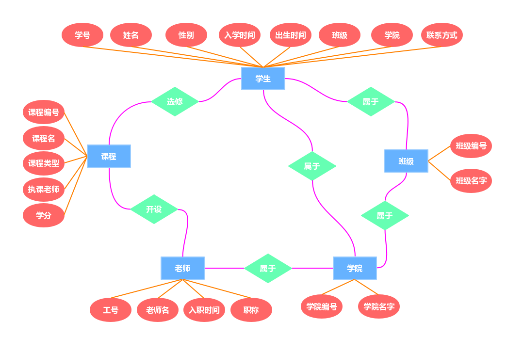

### 数据表

本系统数据库名为AcademicSystem，共8张表：

- class表，记录班级信息
- lesson表，记录课程信息
- school表，记录学院信息
- student表，记录学生信息
- student_account表，记录学生账号信息
- student_lesson表，记录学生选课信息
- teacher表，记录教师信息
- teacher_account表，记录教师账号信息


下面详细解释各个表：


### 学生学籍表

- 学号(如'201508010119')
- 姓名(如'王尼玛')
- 性别(如'男')
- 入学时间(如'2015-09-01 00:00:00')
- 出生时间(如'1997-09-01 00:00:00')
- 民族(如'汉')
- 所属学院编号(如'school08')
- 班级编号(如'JK1501')
- 联系方式(如'18888888888')

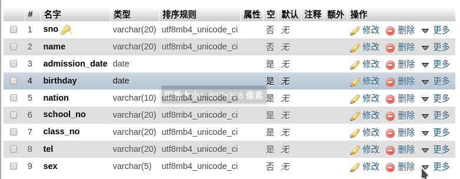


### 教职工信息表

- 工号(如'20000801')
- 姓名(如'张全蛋')
- 入职时间(如'2000-09-01 00:00:00')
- 职称(如'教授')

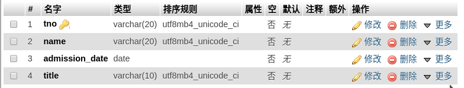

### 班级表

- 班级编号(如'JK1501')
- 班级全称(如'计算机科学与技术1501班')
- 所属学院编号(如'school08')

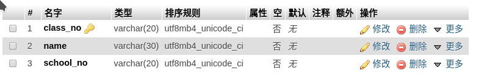

### 课程表

- 课程编号(如'CS201')
- 课程名(如'数据库原理')
- 授课教师工号(如'20000801')
- 课程类型(如'专业核心')
- 学分(如2)

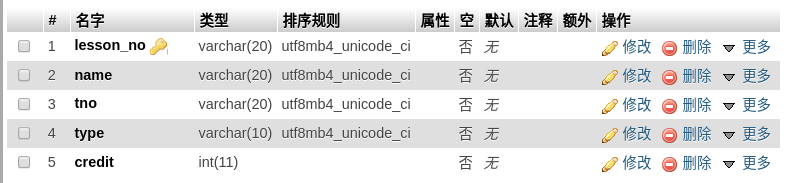

### 学生-课程表

- 学号(如'201508010119')
- 课程编号(如'JK1501')
- 课程最终成绩(如88.5)

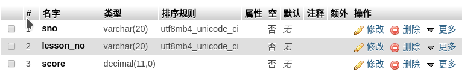

### 学院表

- 学院编号(如'school08')
- 学院名称(如'信息科学与工程学院')

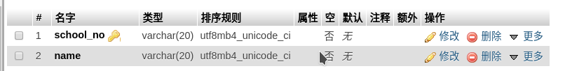

### 学生账号表

- 学号(如'201508010119')
- 密码(如'123456')

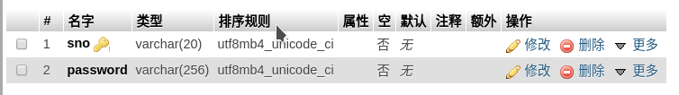

### 教职工账号表

- 工号(如'20000801')
- 密码(如'123456')

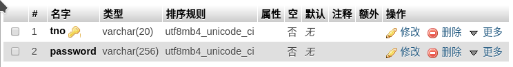


## 后端设计

### 工具

后端使用node.js以及其web开发框架express，主要将功能映射成web API，具体API如下：

- POST /validate  ——验证用户名密码
  - body: account, password, type

    ##### 后端代码如下

  ```js
  app.post('/validate', (req, res) => {
      let account = req.body.account;
      let password = req.body.password;
      let type = req.body.type;
      validate(type, account, password, res);
  });
  
  function validate(type, account, password, res) {
      pool.getConnection((err, conn) => {
          let sql = null;
          if (type == "teacher") {
              sql = "SELECT COUNT(*) as num FROM `teacher_account` WHERE `tno` = ? and `password` = ?";
          } else {
              sql = "SELECT COUNT(*) as num FROM `student_account` WHERE `sno` = ? and `password` = ?";
          }
          conn.query(sql, [account, password], (error, results, fields) => {
              if(err) {
                  res.json({ success: false }).end();
              }
              if(results[0].num === 1) {
                  res.json({success: true}).end();
              } else {
                  res.json({success: false}).end();
              }
              conn.release();
          });
      });
  }
  ```

  

- GET /student?account=?   ——获得学生信息

  ##### 后端代码如下

  ```js
  app.get('/student', (req, res) => {
      let account = req.query.account;
  
      getStudentInfor(account, res);
  })
  
  function getStudentInfor(account, res) {
      pool.getConnection((err, conn) => {
          let sql = "SELECT sno, student.name as name, DATE_FORMAT(admission_date,'%Y年%m月%d日') as admission_date, DATE_FORMAT(birthday,'%Y年%m月%日') as birthday, school.name as school, class.name as class, tel, sex, nation FROM student inner join school on school.school_no = student.school_no inner join class on class.class_no = student.class_no where student.sno = ?";
          conn.query(sql, [account], (err, results, fields) => {
              if(err) {
                  res.json({ success: false }).end();
              }
              if(results.length !== 0) {
                  res.json({success: true, data: results[0]}).end();
              } else {
                  res.json({success: false}).end();
              }
              conn.release();
          });
      });
  }
  ```

  

- GET /teacher?account=?   ——获得教师信息

  ##### 后端代码如下

  ```js
  app.get('/teacher', (req, res) => {
      let account = req.query.account;
  
      getTeacherInfor(account, res);
  })
  
  function getTeacherInfor(account, res) {
      pool.getConnection((err, conn) => {
          let sql = "SELECT tno, name, DATE_FORMAT(admission_date, '%Y年%m月%d日') as admission_date, title from teacher where tno = ?";
          conn.query(sql, [account], (err, results, fields) => {
              if(err) {
                  res.json({ success: false }).end();
              }
              if(results.length !== 0) {
                  res.json({success: true, data: results[0]}).end();
              } else {
                  res.json({success: false}).end();
              }
              conn.release();
          });
      });
  }
  ```

  

- GET /lesson  ——获取所有课程列表

  ##### 后端代码如下

  ```js
  app.get('/lesson', (req, res) => {
      getLessonInfor(res);
  })
  
  function getLessonInfor(res) {
      pool.getConnection((err, conn) => {
          let sql = "select lesson.name as name, lesson_no, teacher.name as teacher, type, credit from lesson inner join teacher on teacher.tno = lesson.tno";
          conn.query(sql, (err, results, fields) => {
              if(err) {
                  res.json({ success: false }).end();
              }
              if(results.length !== 0) {
                  res.json({success: true, data: results}).end();
              } else {
                  res.json({success: true, data: []}).end();
              }
              conn.release();
          });
      });
  }
  ```

  

- POST /lesson ——添加新课程
  - body: lesson_no, name, tno, type, credit

    ##### 后端代码如下

    ```js
    app.post('/lesson', (req, res) => {
        let lesson_no = req.body.lesson_no;
        let name = req.body.name;
        let tno = req.body.tno;
        let type = req.body.type;
        let credit = req.body.credit;
    
        addLesson(lesson_no, name, tno, type, credit, res);
    });
    
    function addLesson(lesson_no, name, tno, type, credit, res) {
        pool.getConnection((err, conn) => {
            let sql = "insert into lesson values (?, ?, ?, ?, ?)";
            conn.query(sql, [lesson_no, name, tno, type, credit], (err, results, fields) => {
                if(err) {
                    res.json({success: false}).end();
                } else {
                    res.json({success: true}).end();
                }
                conn.release();
            })
        })
    }
    ```

    

- GET /student/lesson?account=? ——获取学生选的课程

  ##### 后端代码如下

  ```js
  app.get('/student/lesson', (req, res) => {
      let account = req.query.account;
      
      getStudentLesson(account, res);
  })
  
  function getStudentLesson(account, res) {
      pool.getConnection((err, conn) => {
          let sql = "select lesson.lesson_no as lesson_no, lesson.name as name, score from student_lesson inner join lesson on lesson.lesson_no = student_lesson.lesson_no where sno = ?";
          conn.query(sql, [account], (err, results, fields) => {
              if(err) {
                  res.json({ success: false }).end();
              }
              if(results.length !== 0) {
                  res.json({success: true, data: results}).end();
              } else {
                  res.json({success: true, data: []}).end();
              }
              conn.release();
          });
      });
  }
  ```

  

- POST /student/lesson?account=?&lesson_no=?  ——学生选修课程

  ##### 后端代码如下

  ```js
  app.post('/student/lesson', (req, res) => {
      let account = req.body.account;
      let lesson_no = req.body.lesson_no;
  
      attendLesson(account, lesson_no, res);
  })
  
  function attendLesson(account, lesson_no, res) {
      pool.getConnection((err, conn) => {
          let sql = "insert into student_lesson (sno, lesson_no) values (?, ?)";
          conn.query(sql, [account,lesson_no], (err,results,fields) => {
              if(err) {
                  res.json({ success: false }).end();
              } else {
                  res.json({success: true}).end();
              }
              conn.release();
          })
      })    
  }
  ```

  

- DELETE /student/lesson?account=?&lesson_no=?  ——学生退修课程

  ##### 后端代码如下

  ```js
  app.delete('/student/lesson', (req, res) => {
      let account = req.query.account;
      let lesson_no = req.query.lesson_no;
  
      dropLesson(account,lesson_no,res);
  })
  
  function dropLesson(account, lesson_no, res) {
      pool.getConnection((err, conn) => {
          let sql = "delete from student_lesson where sno = ? and lesson_no = ?";
          conn.query(sql, [account,lesson_no], (err,results,fields) => {
              if(err) {
                  res.json({ success: false }).end();
              } else {
                  res.json({success: true}).end();
              }
              conn.release();
          })
      })    
  }
  ```

  

- GET /teacher/lesson?account=?  ——获取教师的课程

  ##### 后端代码如下

  ```js
  app.get('/teacher/lesson', (req, res) => {
      let account = req.query.account;
      
      teacherGetLesson(account, res);
  })
  
  function teacherGetLesson(account, res) {
      pool.getConnection((err, conn) => {
          let sql = "select * from lesson where tno = ?";
          conn.query(sql, [account], (err, results, fields) => {
              if(err) {
                  res.json({success: false}).end();
              } else {
                  res.json({success: true, data: results}).end();
              }
              conn.release();
          })
      })
  }
  ```

  

- GET /lesson/student?lesson_no=? ——获取课程的所有学生

  ##### 后端代码如下

  ```js
  app.get('/lesson/student', (req, res) => {
      let lesson_no = req.query.lesson_no;
  
      lessonStudent(lesson_no, res);
  })
  
  function lessonStudent(lesson_no, res) {
      pool.getConnection((err, conn) => {
          let sql = "select student_lesson.lesson_no as lesson_no, student.sno as sno, student.name as name, score from student_lesson inner join student on student.sno = student_lesson.sno where student_lesson.lesson_no = ?";
          conn.query(sql, [lesson_no], (err, results, fields) => {
              if(err) {
                  console.log(err);
                  res.json({success:false}).end();
              } else {
                  res.json({success: true, data: results}).end();
              }
              conn.release();
          })
      })
  }
  ```

  

- GET /lesson/score?sno=?&lesson_no=?&score=? 　——设置课程成绩

  ##### 后端代码如下

  ```js
  app.get('/lesson/score', (req, res) => {
      let sno = req.query.sno;
      let lesson_no = req.query.lesson_no;
      let score = req.query.score;
      
      setScore(sno, lesson_no, score, res);
  })
  
  function setScore(sno, lesson_no, score, res) {
      pool.getConnection((err, conn) => {
          let sql = "update student_lesson set score = ? where sno = ? and lesson_no = ?";
          conn.query(sql, [score, sno, lesson_no], (err, results, fields) => {
              if(err) {
                  res.json({success: false}).end();
              } else {
                  res.json({success: true}).end();
              }
              conn.release();
          })
      })
  }
  ```

  

- GET /student/password?sno=?&password=?  ——修改学生密码

  ##### 后端代码如下

  ```js
  app.get('/student/password', (req, res) => {
      let sno = req.query.sno;
      let password = req.query.password;
      
      studentChangePassword(sno, password, res);
  })
  
  function studentChangePassword(sno, password, res) {
      pool.getConnection((err, conn) => {
          let sql = "update student_account set password = ? where sno = ?";
          conn.query(sql, [password, sno], (err, results, fields) => {
              if(err) {
                  res.json({success: false}).end();
              } else {
                  res.json({success: true}).end();
              }
              conn.release();
          })
      })
  }
  ```

  

- GET /teacher/password?tno=?&password=?  ——修改教师密码

  ##### 后端代码如下

  ```js
  app.get('/teacher/password', (req, res) => {
      let tno = req.query.tno;
      let password = req.query.password;
      
      teacherChangePassword(tno, password, res);
  })
  
  function teacherChangePassword(tno, password, res) {
      pool.getConnection((err, conn) => {
          let sql = "update teacher_account set password = ? where tno = ?";
          conn.query(sql, [password, tno], (err, results, fields) => {
              if(err) {
                  res.json({success: false}).end();
              } else {
                  res.json({success: true}).end();
              }
              conn.release();
          })
      })
  }
  ```

  


### SQL语句


```SQL
SELECT COUNT(*) as num FROM `teacher_account` WHERE `tno` = ? and `password` = ?  --验证学生用户名密码

SELECT COUNT(*) as num FROM `student_account` WHERE `sno` = ? and `password` = ?  -- 验证教师用户名密码

SELECT sno, student.name as name, DATE_FORMAT(admission_date,'%Y年%m月%d日') as admission_date, DATE_FORMAT(birthday,'%Y年%m月%日') as birthday, school.name as school, class.name as class, tel, sex, nation FROM student inner join school on school.school_no = student.school_no inner join class on class.class_no = student.class_no where student.sno = ?  -- 获得学生信息

SELECT tno, name, DATE_FORMAT(admission_date, '%Y年%m月%d日') as admission_date, title from teacher where tno = ?   -- 获得教师信息

select lesson.name as name, lesson_no, teacher.name as teacher, type, credit from lesson inner join teacher on teacher.tno = lesson.tno  -- 获取教师的课程

select lesson.lesson_no as lesson_no, lesson.name as name, score from student_lesson inner join lesson on lesson.lesson_no = student_lesson.lesson_no where sno = ?  -- 获取学生选的课程

insert into student_lesson (sno, lesson_no) values (?, ?)  -- 学生选修课程

delete from student_lesson where sno = ? and lesson_no = ?  -- 学生退修课程

select * from lesson where tno = ?  -- 获取教师的课程

select student_lesson.lesson_no as lesson_no, student.sno as sno, student.name as name, score from student_lesson inner join student on student.sno = student_lesson.sno where student_lesson.lesson_no = ?  -- 获取课程的所有学生

update student_lesson set score = ? where sno = ? and lesson_no = ?  -- 设置课程成绩

update student_account set password = ? where sno = ?  -- 修改学生密码

update teacher_account set password = ? where tno = ?  -- 修改教师密码

insert into lesson values (?, ?, ?, ?, ?) -- 添加新课程

```


## 前端设计

### 工具

本系统使用网页作为前端，使用vue.js作为JS Framework，materializecss作为CSS Framework，用户界面基于简单的material design。


### 登录界面


#### 学生登录


##### 前端JS代码

点击登录按钮调用以下代码验证登录，使用AJAX提交HTTP请求

```js
function stuLogin() {
    $('#stu-password').removeClass('invalid');
    let account = $("#stu-account").val();
    let password = $('#stu-password').val();
    let type = "student";
    fetch('/validate', {
            method: "POST",
            headers: {
                "content-type": "application/json"
            },
            body: JSON.stringify({
                account: account,
                password: password,
                type: type
            })
        })
        .then(res => res.json())
        .then(res => {
            if (res.success) {
                app.sno = account;
                fetchStudentData();
                fetchStudentLessonData();
                animate('login-box', 'stu-portal');
            } else {
                $('#stu-password').addClass('invalid');
            }
        })
        .catch(err => console.log(err));
}
```


#### 教师登录

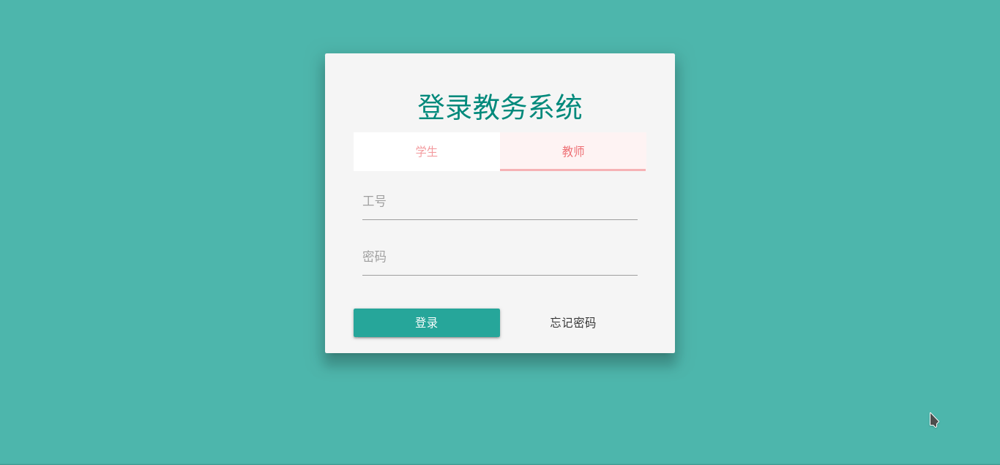

##### 前端JS代码

点击登录按钮调用以下代码验证登录，使用AJAX提交HTTP请求

```js
function teaLogin() {
    $('#tea-password').removeClass('invalid');
    let account = $("#tea-account").val();
    let password = $("#tea-password").val();
    let type = "teacher";
    fetch('/validate', {
            method: "POST",
            headers: {
                'content-type': "application/json"
            },
            body: JSON.stringify({
                account: account,
                password: password,
                type: type
            })
        })
        .then(res => res.json())
        .then(res => {
            if (res.success) {
                app.tno = account;
                fetchTeacherData();
                fetchTeacherLessonData();
                animate('login-box', 'tea-portal');
            } else {
                $('#tea-password').addClass('invalid');
            }
        })
        .catch(err => console.log(err));
}
```


### 学生学籍信息

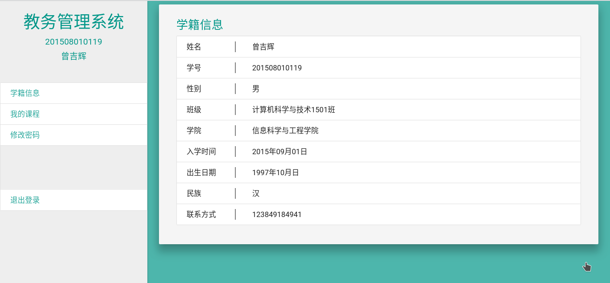

##### 前端JS代码

登陆后调用以下代码获取学生信息

```js
function fetchStudentData() {
    let student_url = new URL(window.location.origin + '/student'),
        params = {
            account: app.sno
        };
    Object.keys(params).forEach(key => student_url.searchParams.append(key, params[key]));
    fetch(student_url).then(res => res.json())
        .then(res => {
            app.student = res.data
        })
        .catch(err => console.log("get student error!"));
}
```


### 学生课程信息

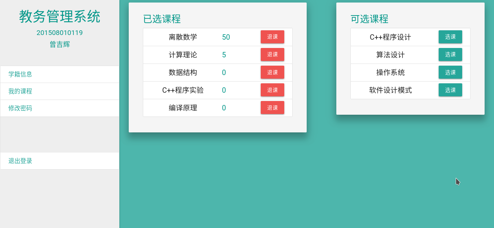

##### 前端JS代码

登录后调用以下代码获取课程信息

```js
function fetchStudentLessonData() {
    fetch('/lesson').then(res => res.json())
        .then(res => app.alllessons = res.data)
        .catch(err => console.log("all lessons error!"));

    let student_lesson_url = new URL(window.location.origin + '/student/lesson'),
        params = {
            account: app.sno
        };
    Object.keys(params).forEach(key => student_lesson_url.searchParams.append(key, params[key]));
    fetch(student_lesson_url).then(res => res.json())
        .then(res => app.mylessons = res.data)
        .catch(err => console.log("my lessons error!"));
}
```

点击选课按钮调用以下代码选课

```js
attendLesson: function (lesson) {
    console.log(lesson);
    fetch('/student/lesson', {
            body: JSON.stringify({
                account: this.student.sno,
                lesson_no: lesson.lesson_no
            }),
            headers: {
                'content-type': 'application/json'
            },
            method: "POST"
        }).then(res => res.json())
        .then(res => res.success ? fetchStudentLessonData() : console.log(
            'attend lesson error!'))
        .catch(err => console.log("attend lesson error!"));
}
```

点击退课按钮调用以下代码退课

```js
dropLesson: function (lesson) {
    let url = new URL(window.location.origin + '/student/lesson'),
        params = {
            account: this.student.sno,
            lesson_no: lesson.lesson_no
        };
    Object.keys(params).forEach(key => url.searchParams.append(key, params[key]));
    fetch(url, {
            method: "DELETE"
        })
        .then(res => res.json())
        .then(res => res.success ? fetchStudentLessonData() : console.log(
            'drop lesson error!'))
        .catch(err => console.log('drop lesson error!'));

```


### 学生修改密码

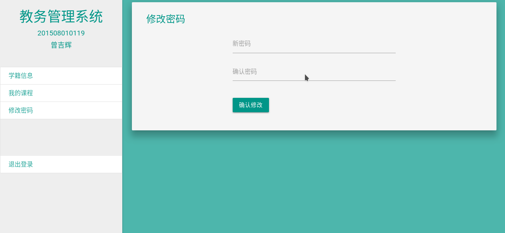

##### 前端JS代码

点击确认修改调用以下代码修改密码

```js
function stuChPassword() {
    let pass2 = document.getElementById('stu-ch-password2');
    if (pass2.checkValidity()) {
        let url = new URL(window.location.origin + '/student/password'),
            params = {
                sno: app.sno,
                password: pass2.value
            };
        Object.keys(params).forEach(key => url.searchParams.append(key, params[key]));
        fetch(url).then(res => res.json())
            .then(res => res.success ? $('#stu-ch-password2').addClass('valid') : console.log("修改密码错误!"))
            .catch(err => console.log("修改密码错误"));
    }
}
```


### 教师信息

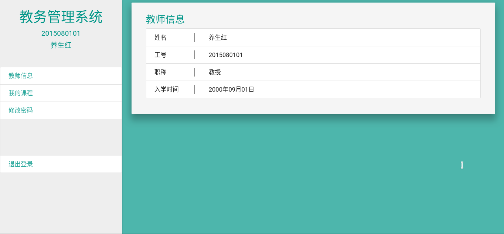

##### 前端JS代码

登录后调用以下代码获取教师信息

```js
function fetchTeacherData() {
    let teacher_url = new URL(window.location.origin + '/teacher'),
        params = {
            account: app.tno
        };
    Object.keys(params).forEach(key => teacher_url.searchParams.append(key, params[key]));
    fetch(teacher_url).then(res => res.json())
        .then(res => {
            app.teacher = res.data
        })
        .catch(err => console.log("get teacher error!"));
}
```


### 教师课程信息

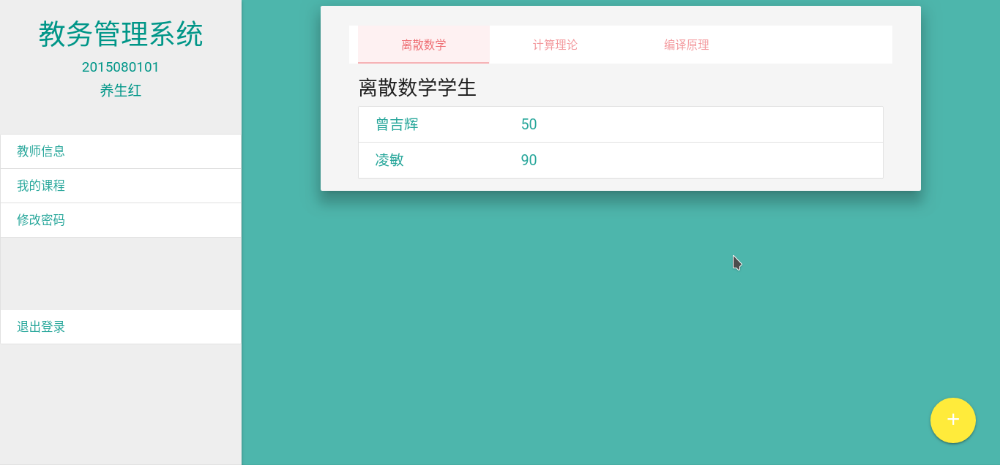

##### 前端JS代码

登录后调用以下代码获取课程信息

```js
function fetchTeacherLessonData() {
    let teacher_lesson_url = new URL(window.location.origin + '/teacher/lesson'),
        params = {
            account: app.tno
        };
    Object.keys(params).forEach(key => teacher_lesson_url.searchParams.append(key, params[key]));
    fetch(teacher_lesson_url).then(res => res.json())
        .then(res => {
            app.tealessons = res.data
        })
        .catch(err => console.log("teacher lesson error!"));
}
```

点击课程后调用以下代码获取课程学生

```js
function getLessonStudent(lesson) {
    let url = new URL(window.location.origin + '/lesson/student'),
        params = {
            lesson_no: lesson.lesson_no
        };
    Object.keys(params).forEach(key => url.searchParams.append(key, params[key]));
    fetch(url).then(res => res.json())
        .then(res => app.lessonstudents = res.data)
        .catch(err => console.log("lesson student error!"));
}
```


#### 修改成绩

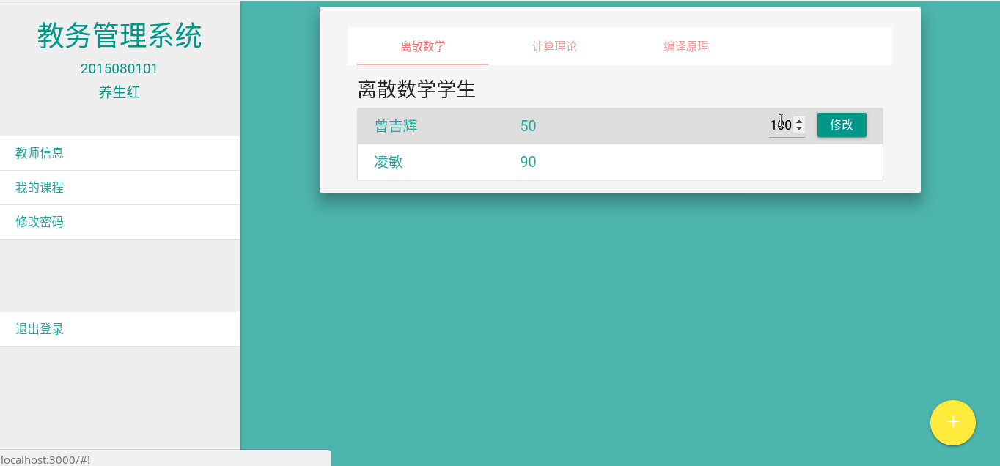

##### 前端JS代码

点击修改按钮后调用以下代码修改成绩

```js
function setScore(studentlesson, score) {
    let url = new URL(window.location.origin + '/lesson/score'),
        params = {
            sno: studentlesson.sno,
            lesson_no: studentlesson.lesson_no,
            score: score
        };
    Object.keys(params).forEach(key => url.searchParams.append(key, params[key]));
    fetch(url).then(res => res.json())
        .then(res => {
            if (res.success) {
                for (d of app.lessonstudents) {
                    if (d.sno === studentlesson.sno) {
                        d.score = score;
                    }
                }
            }
        })
        .catch(err => console.log("set score error!"));
}
```


#### 添加课程

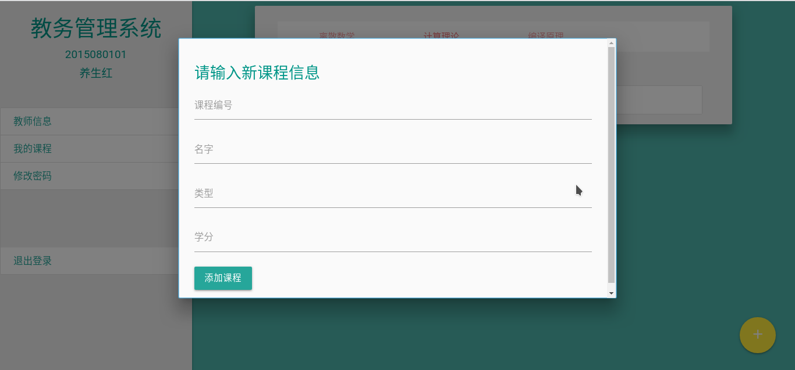

##### 前端JS代码

填好输入框，点击添加课程按钮后调用以下代码添加课程

```js
function addLesson() {
    let lesson_no = $('#al-no').val();
    let name = $('#al-name').val();
    let tno = app.tno;
    let type = $('#al-type').val();
    let credit = $('#al-credit').val();
    fetch('/lesson', {
            method: "POST",
            headers: {
                "content-type": "application/json"
            },
            body: JSON.stringify({
                lesson_no: lesson_no,
                name: name,
                tno: tno,
                type: type,
                credit: credit
            })
        }).then(res => res.json())
        .then(res => {
            res.success ? M.toast({
                html: "添加成功"
            }) : M.toast({
                html: "添加失败"
            })
            app.lessonstudents = null;
            fetchTeacherLessonData();
        });
}
```


### 教师修改密码

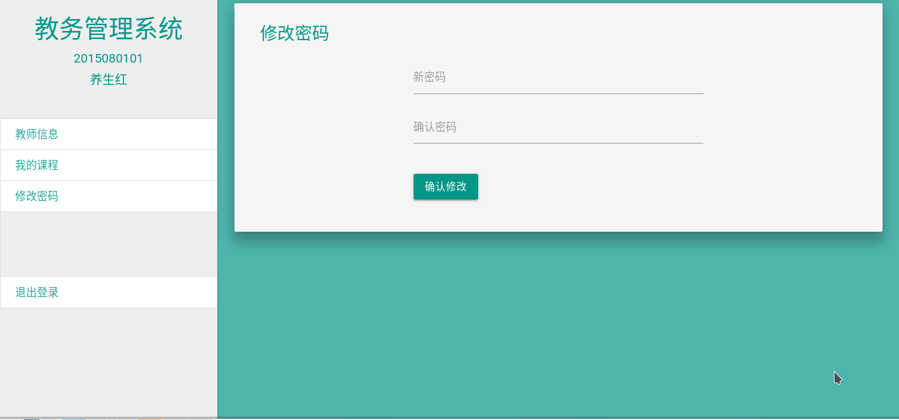

##### 前端JS代码

点击确认修改按钮后调用以下代码修改密码

```js
function teaChPassword() {
    let pass2 = document.getElementById('tea-ch-password2');
    if (pass2.checkValidity()) {
        let url = new URL(window.location.origin + '/teacher/password'),
            params = {
                tno: app.tno,
                password: pass2.value
            };
        Object.keys(params).forEach(key => url.searchParams.append(key, params[key]));
        fetch(url).then(res => res.json())
            .then(res => res.success ? $('#tea-ch-password2').addClass('valid') : console.log("修改密码错误!"))
            .catch(err => console.log("修改密码错误"));
    }
}
```


