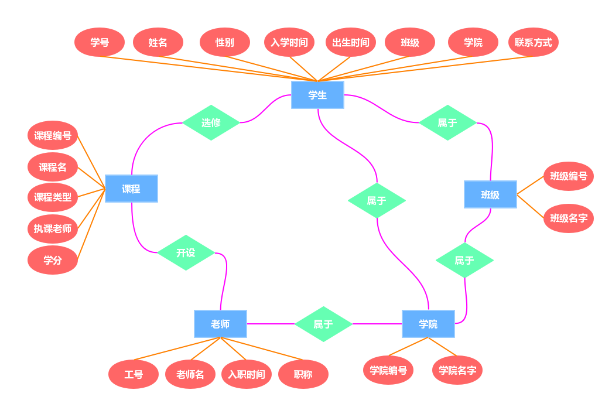
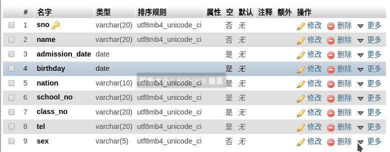
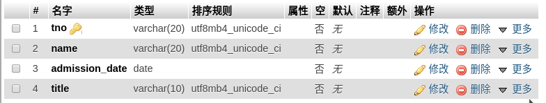
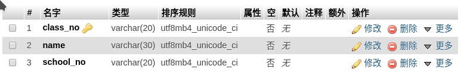
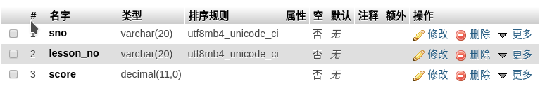
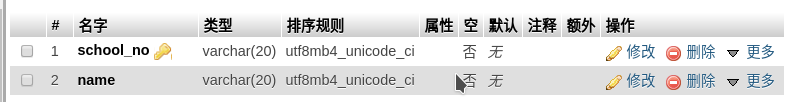
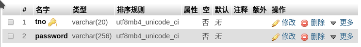

name: index
class: index, center, middle

# 教务管理系统设计

黄智威    邵靳天
李瑜琦    冯姜瑶    贾江鹏

---

name: agenda
class: agenda, middle

# 目录
- 项目功能
- 数据库设计
- 后端设计
- 前端设计

---

class: middle, center
# 项目功能

---

class: middle
# 学生端
- 更改密码
- 选课、退课
- 查看自身学籍信息
- 查询课程成绩

---

class: middle
# 教师端
- 更改密码
- 获取自己课程列表
- 发布课程
- 获得课程所有学生
- 为学生录入分数

---

class: middle, center
# 数据库设计

---

# E-R图
五个实体:学生，老师，班级，学院，课程
.img-fit[]

---
class: middle
# 数据表

本系统数据库名为AcademicSystem，共8张表：

- class表，记录班级信息
- lesson表，记录课程信息
- school表，记录学院信息
- student表，记录学生信息
- student_account表，记录学生账号信息
- student_lesson表，记录学生选课信息
- teacher表，记录教师信息
- teacher_account表，记录教师账号信息

---

### 学生学籍表

- 学号(如'201508010119')
- 姓名(如'王尼玛')
- 性别(如'男')
- 入学时间(如'2015-09-01 00:00:00')
- 出生时间(如'1997-09-01 00:00:00')
- 民族(如'汉')
- 所属学院编号(如'school08')
- 班级编号(如'JK1501')
- 联系方式(如'18888888888')

.img-fit[]

---

### 教职工信息表

- 工号(如'20000801')
- 姓名(如'张全蛋')
- 入职时间(如'2000-09-01 00:00:00')
- 职称(如'教授')

.img-fit[]

---

### 班级表

- 班级编号(如'JK1501')
- 班级全称(如'计算机科学与技术1501班')
- 所属学院编号(如'school08')

.img-fit[]

---

### 课程表

- 课程编号(如'CS201')
- 课程名(如'数据库原理')
- 授课教师工号(如'20000801')
- 课程类型(如'专业核心')
- 学分(如2)

.img-fit[]

---

### 学生-课程表

- 学号(如'201508010119')
- 课程编号(如'JK1501')
- 课程最终成绩(如88.5)

.img-fit[]

---

### 学院表

- 学院编号(如'school08')
- 学院名称(如'信息科学与工程学院')

.img-fit[]

---

### 学生账号表

- 学号(如'201508010119')
- 密码(如'123456')

.img-fit[]

---

### 教职工账号表

- 工号(如'20000801')
- 密码(如'123456')

.img-fit[]

---

class: middle, center
# 后端设计

---
# 后端API
- POST /validate  ——验证用户名密码
  - body: account, password, type
- GET /student?account=?   ——获得学生信息
- GET /teacher?account=?   ——获得教师信息
- GET /lesson  ——获取所有课程列表
- POST /lesson ——添加新课程
  - body: lesson_no, name, tno, type, credit
- GET /student/lesson?account=? ——获取学生选的课程
- POST /student/lesson?account=?&lesson_no=?  ——学生选修课程
- DELETE /student/lesson?account=?&lesson_no=?  ——学生退修课程
- GET /teacher/lesson?account=?  ——获取教师的课程
- GET /lesson/student?lesson_no=? ——获取课程的所有学生
- GET /lesson/score?sno=?&lesson_no=?&score=? 　——设置课程成绩
- GET /student/password?sno=?&password=?  ——修改学生密码

---

### SQL语句

后端开发通过对数据库的SQL语句查询实现功能，使用到的SQL语句如下：

```SQL
SELECT COUNT(*) as num FROM `teacher_account` WHERE `tno` = ? and `password` = ?  --验证学生用户名密码

SELECT COUNT(*) as num FROM `student_account` WHERE `sno` = ? and `password` = ?  -- 验证教师用户名密码

SELECT sno, student.name as name, DATE_FORMAT(admission_date,'%Y年%m月%d日') as admission_date, DATE_FORMAT(birthday,'%Y年%m月%日') as birthday, school.name as school, class.name as class, tel, sex, nation FROM student inner join school on school.school_no = student.school_no inner join class on class.class_no = student.class_no where student.sno = ?  -- 获得学生信息

SELECT tno, name, DATE_FORMAT(admission_date, '%Y年%m月%d日') as admission_date, title from teacher where tno = ?   -- 获得教师信息

```

---
### SQL语句

后端开发通过对数据库的SQL语句查询实现功能，使用到的SQL语句如下：
```SQL
select lesson.name as name, lesson_no, teacher.name as teacher, type, credit from lesson inner join teacher on teacher.tno = lesson.tno  -- 获取教师的课程

select lesson.lesson_no as lesson_no, lesson.name as name, score from student_lesson inner join lesson on lesson.lesson_no = student_lesson.lesson_no where sno = ?  -- 获取学生选的课程

insert into student_lesson (sno, lesson_no) values (?, ?)  -- 学生选修课程

delete from student_lesson where sno = ? and lesson_no = ?  -- 学生退修课程

select * from lesson where tno = ?  -- 获取教师的课程
```
---

### SQL语句

后端开发通过对数据库的SQL语句查询实现功能，使用到的SQL语句如下：
```SQL
select student_lesson.lesson_no as lesson_no, student.sno as sno, student.name as name, score from student_lesson inner join student on student.sno = student_lesson.sno where student_lesson.lesson_no = ?  -- 获取课程的所有学生

update student_lesson set score = ? where sno = ? and lesson_no = ?  -- 设置课程成绩

update student_account set password = ? where sno = ?  -- 修改学生密码

update teacher_account set password = ? where tno = ?  -- 修改教师密码

insert into lesson values (?, ?, ?, ?, ?) -- 添加新课程

```
---

class: middle, center
# 前端设计

